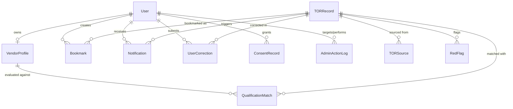

# Data Model: I Cheer TOR Platform Baseline

**Date**: 2026-08-24 | **Spec**: [spec.md](file:///c:/work/collaborative/Software-Process/specs/001-icheertor-platform-baseline/spec.md)

## Entity Relationship Overview



---

## Entities

### User

Represents a registered platform user authenticated via Google OAuth.

| Field | Type | Constraints | Description |
|-------|------|-------------|-------------|
| `_id` | ObjectId | PK, auto | Internal identifier |
| `googleId` | String | unique, required, indexed | Google OAuth subject ID |
| `email` | String | unique, required, indexed | User's email from Google |
| `name` | String | required | Display name from Google profile |
| `avatarUrl` | String | optional | Profile image URL |
| `role` | String | required, enum: `user`, `admin` | Access control role |
| `status` | String | required, enum: `pending`, `active`, `suspended`, `banned` | Account status |
| `isVerified` | Boolean | default: false | Admin-verified identity |
| `notificationPrefs` | Object | embedded | Channel preferences |
| `notificationPrefs.inApp` | Boolean | default: true | In-app notifications enabled |
| `notificationPrefs.email` | Boolean | default: false | Email notifications enabled |
| `notificationPrefs.line` | Boolean | default: false | LINE notifications enabled |
| `notificationPrefs.lineUserId` | String | optional | LINE user ID for push messages |
| `locale` | String | default: `th` | Preferred UI language (`th`, `en`) |
| `lastLoginAt` | Date | optional | Most recent login timestamp |
| `createdAt` | Date | auto | Account creation timestamp |
| `updatedAt` | Date | auto | Last modification timestamp |
| `deletedAt` | Date | optional | Soft-delete timestamp (PDPA) |

**Indexes**: `{ googleId: 1 }` (unique), `{ email: 1 }` (unique), `{ status: 1 }`, `{ role: 1 }`

**Validation rules**:
- `email` must be a valid email format
- `role` must be one of `user` or `admin`
- `status` must be one of `pending`, `active`, `suspended`, `banned`

**State transitions**:
```
pending → active      (admin approval)
active → suspended    (admin action, reversible)
active → banned       (admin action, permanent)
suspended → active    (admin reinstatement)
active → deleted      (user self-deletion, PDPA)
```

---

### VendorProfile

A software team's company profile used for qualification matching.

| Field | Type | Constraints | Description |
|-------|------|-------------|-------------|
| `_id` | ObjectId | PK, auto | Internal identifier |
| `userId` | ObjectId | required, unique, ref: User, indexed | Profile owner |
| `companyName` | String | required | Company legal name |
| `companyAge` | Number | required, min: 0 | Years since incorporation |
| `pastContracts` | Array\<Object\> | optional | Historical contract records |
| `pastContracts[].description` | String | required | Contract description |
| `pastContracts[].value` | Number | required, min: 0 | Contract value in THB |
| `pastContracts[].year` | Number | required | Year of contract |
| `pastContracts[].agencyName` | String | optional | Contracting agency |
| `maxContractValue` | Number | computed | Largest past contract value (derived) |
| `techStacks` | Array\<String\> | optional | Technology capabilities |
| `credentials` | Array\<Object\> | optional | Certifications and qualifications |
| `credentials[].name` | String | required | Credential name (e.g., ISO 27001) |
| `credentials[].issuedBy` | String | optional | Issuing authority |
| `credentials[].expiresAt` | Date | optional | Expiration date |
| `teamSize` | Number | optional, min: 1 | Number of team members |
| `createdAt` | Date | auto | Profile creation timestamp |
| `updatedAt` | Date | auto | Last modification timestamp |

**Indexes**: `{ userId: 1 }` (unique)

**Validation rules**:
- `companyAge` must be ≥ 0
- `pastContracts[].value` must be ≥ 0
- One profile per user (enforced by unique `userId` index)

---

### TORRecord

A parsed procurement opportunity with structured extraction data.

| Field | Type | Constraints | Description |
|-------|------|-------------|-------------|
| `_id` | ObjectId | PK, auto | Internal identifier |
| `title` | String | required, indexed (text) | TOR announcement title |
| `agencyName` | String | required, indexed | Procuring agency name |
| `phase` | String | required, enum: `public_hearing`, `bidding`, `awarded`, `cancelled` | Procurement phase |
| `medianPrice` | Number | optional, min: 0 | ราคากลาง in THB |
| `budget` | Number | optional, min: 0 | Project budget in THB |
| `postingDate` | Date | required, indexed | Date posted on source portal |
| `publicHearingStart` | Date | optional | Public hearing open date |
| `publicHearingEnd` | Date | optional | Public hearing close date |
| `submissionDeadline` | Date | optional, indexed | Bid submission deadline |
| `awardDate` | Date | optional | Award announcement date |
| `sourceUrl` | String | required | Primary source announcement URL |
| `officialPortalUrl` | String | optional | e-GP/BMA bid submission URL |
| `pdfUrl` | String | optional | URL to the TOR PDF document |
| `pdfStoragePath` | String | optional | Internal path to stored PDF |
| `parsedData` | Object | embedded | AI-extracted structured fields |
| `parsedData.scopeOfWork` | Object | nested | Scope of work extraction |
| `parsedData.scopeOfWork.content` | String | optional | Extracted text |
| `parsedData.scopeOfWork.confidence` | Number | min: 0, max: 1 | Extraction confidence |
| `parsedData.qualifications` | Array\<Object\> | nested | Qualification criteria |
| `parsedData.qualifications[].criterion` | String | required | Criterion description |
| `parsedData.qualifications[].minimumValue` | Mixed | optional | Minimum threshold |
| `parsedData.qualifications[].type` | String | enum: `contract_value`, `company_age`, `tech_stack`, `certification`, `other` | Criterion category |
| `parsedData.qualifications[].confidence` | Number | min: 0, max: 1 | Extraction confidence |
| `parsedData.medianPrice` | Object | nested | Median price extraction |
| `parsedData.medianPrice.value` | Number | optional | Extracted price value |
| `parsedData.medianPrice.confidence` | Number | min: 0, max: 1 | Extraction confidence |
| `parsedData.evaluationCriteria` | Object | nested | Evaluation criteria extraction |
| `parsedData.evaluationCriteria.content` | String | optional | Extracted text |
| `parsedData.evaluationCriteria.confidence` | Number | min: 0, max: 1 | Extraction confidence |
| `redFlags` | Array\<Object\> | embedded | Detected red-flag clauses |
| `redFlags[].clauseText` | String | required | Flagged clause text |
| `redFlags[].reason` | String | required | Why it was flagged |
| `redFlags[].severity` | String | enum: `info`, `warning`, `critical` | Flag severity |
| `redFlags[].recommendedAction` | String | required | Suggested user action |
| `redFlags[].ruleId` | String | required | ID of the rule that triggered this flag |
| `extractionStatus` | String | required, enum: `pending`, `processing`, `completed`, `failed` | AI extraction status |
| `extractionError` | String | optional | Error message if extraction failed |
| `deduplicationHash` | String | unique, indexed | Hash for cross-source de-duplication |
| `tags` | Array\<String\> | optional, indexed | Category tags (tech stack keywords) |
| `createdAt` | Date | auto | Record creation timestamp |
| `updatedAt` | Date | auto | Last modification timestamp |

**Indexes**: `{ deduplicationHash: 1 }` (unique), `{ agencyName: 1, postingDate: -1 }`, `{ phase: 1 }`, `{ submissionDeadline: 1 }`, `{ extractionStatus: 1 }`, text index on `{ title: 'text', 'parsedData.scopeOfWork.content': 'text', agencyName: 'text', tags: 'text' }`

**Validation rules**:
- `phase` must be one of `public_hearing`, `bidding`, `awarded`, `cancelled`
- Confidence scores must be between 0.0 and 1.0
- `deduplicationHash` generated from: normalised title + agency + posting date

**State transitions**:
```
(created) → pending       (ingested from scraper)
pending → processing      (sent to Vertex AI)
processing → completed    (extraction successful)
processing → failed       (extraction error)
failed → processing       (retry triggered)

Phase transitions:
public_hearing → bidding  (hearing window closes)
bidding → awarded         (award published)
bidding → cancelled       (procurement cancelled)
```

---

### TORSource

A raw scraped source reference linked to a canonical TOR record for de-duplication.

| Field | Type | Constraints | Description |
|-------|------|-------------|-------------|
| `_id` | ObjectId | PK, auto | Internal identifier |
| `torRecordId` | ObjectId | required, ref: TORRecord, indexed | Canonical TOR record |
| `portalName` | String | required, enum: `bma`, `egp` | Source portal identifier |
| `sourceUrl` | String | required | Original URL on portal |
| `scrapedAt` | Date | required | When this source was scraped |
| `rawHtml` | String | optional | Raw HTML snapshot (for debugging) |
| `structuralChangeDetected` | Boolean | default: false | Flag if DOM structure differed from expected |
| `createdAt` | Date | auto | Record creation timestamp |

**Indexes**: `{ torRecordId: 1 }`, `{ portalName: 1, sourceUrl: 1 }` (unique compound)

---

### Bookmark

A user's saved reference to a TOR listing with deadline tracking.

| Field | Type | Constraints | Description |
|-------|------|-------------|-------------|
| `_id` | ObjectId | PK, auto | Internal identifier |
| `userId` | ObjectId | required, ref: User, indexed | Bookmark owner |
| `torRecordId` | ObjectId | required, ref: TORRecord, indexed | Bookmarked TOR |
| `reminderSent` | Object | embedded | Reminder delivery tracking |
| `reminderSent.submission` | Boolean | default: false | Submission deadline reminder sent |
| `reminderSent.publicHearing` | Boolean | default: false | Public hearing reminder sent |
| `notes` | String | optional, maxlength: 500 | User's personal notes |
| `createdAt` | Date | auto | Bookmark creation timestamp |

**Indexes**: `{ userId: 1, torRecordId: 1 }` (unique compound — prevents duplicate bookmarks)

---

### Notification

A dispatched notification record.

| Field | Type | Constraints | Description |
|-------|------|-------------|-------------|
| `_id` | ObjectId | PK, auto | Internal identifier |
| `userId` | ObjectId | required, ref: User, indexed | Notification recipient |
| `torRecordId` | ObjectId | optional, ref: TORRecord | Related TOR listing |
| `type` | String | required, enum: `new_match`, `public_hearing`, `deadline`, `award`, `system` | Event type |
| `title` | String | required | Notification title |
| `body` | String | required | Notification body text |
| `linkUrl` | String | optional | Deep link to relevant page |
| `channels` | Object | embedded | Per-channel delivery status |
| `channels.inApp` | Object | nested | In-app delivery |
| `channels.inApp.sent` | Boolean | default: false | Delivered to in-app feed |
| `channels.inApp.readAt` | Date | optional | When user read it |
| `channels.email` | Object | nested | Email delivery |
| `channels.email.sent` | Boolean | default: false | Email dispatched |
| `channels.email.sentAt` | Date | optional | Email send timestamp |
| `channels.email.error` | String | optional | Delivery error message |
| `channels.line` | Object | nested | LINE delivery |
| `channels.line.sent` | Boolean | default: false | LINE message dispatched |
| `channels.line.sentAt` | Date | optional | LINE send timestamp |
| `channels.line.error` | String | optional | Delivery error message |
| `createdAt` | Date | auto | Notification creation timestamp |

**Indexes**: `{ userId: 1, createdAt: -1 }`, `{ userId: 1, 'channels.inApp.readAt': 1 }` (for unread count), `{ type: 1 }`

---

### UserCorrection

A user-submitted correction to an AI-extracted field.

| Field | Type | Constraints | Description |
|-------|------|-------------|-------------|
| `_id` | ObjectId | PK, auto | Internal identifier |
| `userId` | ObjectId | required, ref: User, indexed | Correcting user |
| `torRecordId` | ObjectId | required, ref: TORRecord, indexed | Corrected TOR record |
| `fieldPath` | String | required | Dot-notation path to corrected field |
| `originalValue` | Mixed | required | Value before correction |
| `correctedValue` | Mixed | required | User-provided value |
| `status` | String | required, enum: `pending`, `accepted`, `rejected` | Review status |
| `reviewedBy` | ObjectId | optional, ref: User | Admin who reviewed |
| `reviewedAt` | Date | optional | Review timestamp |
| `createdAt` | Date | auto | Correction submission timestamp |

**Indexes**: `{ torRecordId: 1, fieldPath: 1 }`, `{ status: 1 }`

---

### ConsentRecord

A log of a user's consent decision for PDPA compliance.

| Field | Type | Constraints | Description |
|-------|------|-------------|-------------|
| `_id` | ObjectId | PK, auto | Internal identifier |
| `userId` | ObjectId | required, ref: User, indexed | Data subject |
| `purpose` | String | required | Processing purpose identifier |
| `granted` | Boolean | required | Consent granted or revoked |
| `scope` | String | required | Scope description |
| `ipAddress` | String | optional | IP at time of consent |
| `userAgent` | String | optional | Browser user agent |
| `createdAt` | Date | auto | Consent action timestamp |

**Indexes**: `{ userId: 1, purpose: 1, createdAt: -1 }`

**Note**: Consent records are append-only. Revocation creates a new record with `granted: false`. Latest record per purpose determines current consent state.

---

### AdminActionLog

An audit record of administrative actions.

| Field | Type | Constraints | Description |
|-------|------|-------------|-------------|
| `_id` | ObjectId | PK, auto | Internal identifier |
| `adminUserId` | ObjectId | required, ref: User, indexed | Admin who performed action |
| `targetUserId` | ObjectId | required, ref: User, indexed | User affected |
| `action` | String | required, enum: `approve`, `verify`, `suspend`, `ban`, `reinstate`, `delete_profile` | Action taken |
| `reason` | String | optional | Admin's reason for the action |
| `previousStatus` | String | required | Target user's status before action |
| `newStatus` | String | required | Target user's status after action |
| `createdAt` | Date | auto | Action timestamp |

**Indexes**: `{ adminUserId: 1, createdAt: -1 }`, `{ targetUserId: 1 }`

**Note**: Admin action logs are append-only and immutable for audit trail integrity.
