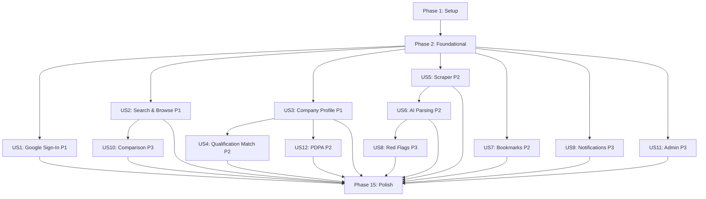

# Tasks: I Cheer TOR Platform Baseline

**Feature**: I Cheer TOR Platform Baseline
**Branch**: `001-icheertor-platform-baseline`
**Date**: 2026-08-24
**Spec**: [spec.md](specs/001-icheertor-platform-baseline/spec.md)
**Plan**: [plan.md](specs/001-icheertor-platform-baseline/plan.md)

---

## Phase 1: Setup (Environment & Foundation)

**Purpose**: Next.js project initialization, Tailwind + MUI configuration, MongoDB connection, and Google OAuth setup

- [ ] T001 Initialize Next.js 15 project with App Router and TypeScript in project root using `npx create-next-app@latest`
- [ ] T002 [P] Install and configure Tailwind CSS 4 with design tokens from `SRS/stitch_icheertor/stitch_icheertor/civic_procurement_interface/DESIGN.md` in `app/globals.css` and `tailwind.config.ts`
- [ ] T003 [P] Install and configure Material UI (MUI) 6 with `StyledEngineProvider injectFirst` and custom theme matching DESIGN.md tokens in `lib/theme/mui-theme.ts`
- [ ] T004 [P] Configure ESLint and Prettier rules in `.eslintrc.json` and `.prettierrc`
- [ ] T005 Install Mongoose 8 and configure MongoDB Atlas connection singleton in `lib/db/connection.ts`
- [ ] T006 [P] Install and configure NextAuth.js v5 with Google OAuth provider in `lib/auth/auth-options.ts` and route handler in `app/(auth)/api/auth/[...nextauth]/route.ts`
- [ ] T007 [P] Create environment variable template in `.env.example` with all required variables from `specs/001-icheertor-platform-baseline/quickstart.md`
- [ ] T008 [P] Install utility dependencies: `node-cron`, `nodemailer`, `@line/bot-sdk`, `@google-cloud/vertexai`, `cheerio`
- [ ] T009 Create root layout with MUI ThemeProvider, Tailwind globals, Inter font import, and metadata in `app/layout.tsx`
- [ ] T010 [P] Configure Vitest for unit/integration testing in `vitest.config.ts` and install `mongodb-memory-server`
- [ ] T011 [P] Create date conversion utility for Buddhist Era ↔ Gregorian in `lib/utils/date-converter.ts`
- [ ] T012 [P] Create Thai Baht currency formatter in `lib/utils/currency-formatter.ts`
- [ ] T013 [P] Create i18n utility for Thai/English string management in `lib/utils/i18n.ts`

**Checkpoint**: Project boots with `npm run dev`, shows blank page at `/`, ESLint passes, MongoDB connects, OAuth redirect works.

---

## Phase 2: Foundational (Schema & Data Access Layer)

**Purpose**: Mongoose models for all entities and seed scripts — MUST complete before any user story work

**⚠️ CRITICAL**: No user story work can begin until this phase is complete

- [ ] T014 Create User Mongoose model with Google OAuth fields, roles, status, notification prefs, and indexes in `lib/db/models/user.ts`
- [ ] T015 [P] Create VendorProfile Mongoose model with company fields, past contracts array, tech stacks, credentials, and indexes in `lib/db/models/vendor-profile.ts`
- [ ] T016 [P] Create TORRecord Mongoose model with metadata, parsedData embedded subdocument, redFlags array, extraction status, deduplication hash, and text index in `lib/db/models/tor-record.ts`
- [ ] T017 [P] Create TORSource Mongoose model with portal reference and structural change detection flag in `lib/db/models/tor-source.ts`
- [ ] T018 [P] Create Bookmark Mongoose model with user/TOR reference and reminder tracking in `lib/db/models/bookmark.ts`
- [ ] T019 [P] Create Notification Mongoose model with multi-channel delivery status tracking in `lib/db/models/notification.ts`
- [ ] T020 [P] Create UserCorrection Mongoose model with field path, original/corrected values, and review status in `lib/db/models/user-correction.ts`
- [ ] T021 [P] Create ConsentRecord Mongoose model (append-only) with purpose, granted flag, scope, and IP in `lib/db/models/consent-record.ts`
- [ ] T022 [P] Create AdminActionLog Mongoose model (immutable) with admin/target user refs and action enum in `lib/db/models/admin-action-log.ts`
- [ ] T023 Create auth middleware for route protection and role-based access in `lib/auth/middleware.ts`
- [ ] T024 [P] Create PDPA consent middleware that blocks data processing without active consent in `lib/auth/middleware.ts`
- [ ] T025 Create seed script with sample TOR records (Thai procurement data), demo users, and vendor profiles in `scripts/seed.ts`
- [ ] T026 [P] Create shared API response envelope helpers (success/error format) in `lib/utils/api-response.ts`

**Checkpoint**: All 9 Mongoose models compile and connect to MongoDB. Seed script populates demo data. Auth middleware protects routes.

---

## Phase 3: User Story 1 — Google Sign-In & Session Management (Priority: P1) 🎯 MVP

**Goal**: Users can sign in with Google, establish a session, and access the authenticated dashboard.

**Independent Test**: Complete Google OAuth round-trip → dashboard redirect with user name displayed.

### Implementation for User Story 1

- [ ] T027 [US1] Build landing page at `app/page.tsx` matching the `LandingPage/` mockup with hero section, how-it-works cards, and feature strip
- [ ] T028 [US1] Create shared TopBar component with iCheerTOR logo and sign-in button in `components/layout/TopBar.tsx`
- [ ] T029 [US1] Create login page with "Sign in with Google" button at `app/(auth)/login/page.tsx`
- [ ] T030 [US1] Implement NextAuth session callback to create/retrieve User document on login in `lib/auth/auth-options.ts`
- [ ] T031 [US1] Create dashboard layout shell with persistent 260px Sidebar and TopBar in `app/(dashboard)/layout.tsx`
- [ ] T032 [P] [US1] Create Sidebar component with navigation links matching mockup (Dashboard, Procurement, Alerts, Profile, Bookmarks) in `components/layout/Sidebar.tsx`
- [ ] T033 [P] [US1] Create MobileNav component with hamburger menu for screens <768px in `components/layout/MobileNav.tsx`
- [ ] T034 [US1] Build user dashboard page at `app/(dashboard)/dashboard/page.tsx` matching `dashboard/` mockup with summary cards and tracked opportunities

**Checkpoint**: User can sign in with Google → land on dashboard → see their name/avatar → navigate via sidebar.

---

## Phase 4: User Story 2 — Browse & Search TOR Opportunities (Priority: P1) 🎯 MVP

**Goal**: Authenticated users can search, filter, and browse TOR listings with source attribution links.

**Independent Test**: Apply filters → see matching results → click through to TOR detail page with parsed data.

### Implementation for User Story 2

- [ ] T035 [US2] Implement TOR listing API route with search, filter, sort, and pagination in `app/api/tor/route.ts`
- [ ] T036 [US2] Implement single TOR detail API route with populated sources in `app/api/tor/[id]/route.ts`
- [ ] T037 [P] [US2] Create SearchBar component with full-text search input in `components/search/SearchBar.tsx`
- [ ] T038 [P] [US2] Create FilterPanel component with agency, budget range, phase, tech stack, and eligibility filters in `components/search/FilterPanel.tsx`
- [ ] T039 [P] [US2] Create TORCard component with title, agency, budget, deadline, match score, and source link in `components/tor/TORCard.tsx`
- [ ] T040 [P] [US2] Create PillBadge component for status/phase indicators in `components/shared/PillBadge.tsx`
- [ ] T041 [P] [US2] Create EmptyState component for no-results display in `components/shared/EmptyState.tsx`
- [ ] T042 [US2] Build procurement listing page at `app/(dashboard)/procurement/page.tsx` matching `ProcumentPage/` mockup with search, filters, and result cards
- [ ] T043 [P] [US2] Create ConfidenceBadge component for AI extraction confidence display in `components/tor/ConfidenceBadge.tsx`
- [ ] T044 [US2] Create TORDetail component displaying all parsed fields with confidence badges and source links in `components/tor/TORDetail.tsx`
- [ ] T045 [US2] Build TOR detail page at `app/(dashboard)/procurement/[id]/page.tsx` with full parsed data, source attribution, and official portal outbound link

**Checkpoint**: User can search/filter TOR listings → view detail with parsed data → see source links to e-GP/BMA.

---

## Phase 5: User Story 3 — Manage Company Profile (Priority: P1) 🎯 MVP

**Goal**: Software teams can create and update their company profile for qualification matching.

**Independent Test**: Create profile with all fields → save → reload → data persists correctly.

### Implementation for User Story 3

- [ ] T046 [US3] Implement vendor profile CRUD API routes (GET/POST/PUT) with owner-only access in `app/api/profile/route.ts`
- [ ] T047 [P] [US3] Create ProfileForm component with company name, age, past contracts, tech stacks, credentials, team size in `components/profile/ProfileForm.tsx`
- [ ] T048 [US3] Build team profile page at `app/(dashboard)/profile/page.tsx` matching `TeamProfilePage/` mockup with profile form and PDPA data settings section

**Checkpoint**: User creates/updates company profile → data persists → profile page displays correctly.

---

## Phase 6: User Story 4 — View Qualification Match (Priority: P2)

**Goal**: Per-criterion pass/fail eligibility breakdown displayed on TOR detail pages.

**Independent Test**: Open TOR detail with completed profile → see per-criterion pass/fail with gap analysis.

### Implementation for User Story 4

- [ ] T049 [US4] Implement qualification matcher service with per-criterion evaluation in `lib/services/matching/qualification-matcher.ts`
- [ ] T050 [US4] Implement gap analyzer for failing criteria with bridgeable-gap detection in `lib/services/matching/gap-analyzer.ts`
- [ ] T051 [US4] Implement qualification match API route in `app/api/tor/[id]/match/route.ts`
- [ ] T052 [P] [US4] Create MatchSummary component with overall score badge and pass/fail count in `components/tor/MatchSummary.tsx`
- [ ] T053 [P] [US4] Create QualificationGrid component with per-criterion rows, status icons, gap values, and bridgeable indicators in `components/profile/QualificationGrid.tsx`
- [ ] T054 [US4] Integrate MatchSummary and QualificationGrid into TOR detail page at `app/(dashboard)/procurement/[id]/page.tsx`
- [ ] T055 [US4] Add profile-incomplete prompt: if user has no profile, show CTA to complete profile before match results in `app/(dashboard)/procurement/[id]/page.tsx`

**Checkpoint**: User with profile opens TOR → sees per-criterion pass/fail → gap values for failures → bridgeable indicator.

---

## Phase 7: User Story 5 — Automated TOR Aggregation & Ingestion (Priority: P2)

**Goal**: Scheduled scraping of BMA/e-GP portals with de-duplication and failure resilience.

**Independent Test**: Trigger scrape cycle → new TOR records appear in DB → de-duplicated across sources.

### Implementation for User Story 5

- [ ] T056 [US5] Implement base scraper adapter abstract class with rate limiting interface in `lib/services/scraper/adapters/base-adapter.ts`
- [ ] T057 [P] [US5] Implement BMA portal scraper adapter with HTML parsing via cheerio in `lib/services/scraper/adapters/bma-adapter.ts`
- [ ] T058 [P] [US5] Implement e-GP portal scraper adapter with HTML parsing via cheerio in `lib/services/scraper/adapters/egp-adapter.ts`
- [ ] T059 [US5] Implement robots.txt checker and rate limiter in `lib/services/scraper/robots-checker.ts`
- [ ] T060 [US5] Implement cross-source de-duplicator using title+agency+date hash in `lib/services/scraper/deduplicator.ts`
- [ ] T061 [US5] Implement scrape scheduler with node-cron and per-adapter orchestration in `lib/services/scraper/scheduler.ts`
- [ ] T062 [US5] Implement scrape trigger API route secured by cron secret header in `app/api/cron/scrape/route.ts`
- [ ] T063 [US5] Implement scraper status API route for admin monitoring in `app/api/admin/scraper/route.ts`

**Checkpoint**: Scrape trigger → adapters fetch from portals → records stored with de-duplication → structural change alerts.

---

## Phase 8: User Story 6 — AI-Powered TOR Parsing (Priority: P2)

**Goal**: TOR PDFs parsed into structured fields with confidence scores, fallback states, and user corrections.

**Independent Test**: Submit TOR PDF → see structured fields with confidence scores → correct a field → correction persists.

### Implementation for User Story 6

- [ ] T064 [US6] Implement circuit breaker with configurable failure threshold and cooldown in `lib/services/ai/circuit-breaker.ts`
- [ ] T065 [US6] Implement Vertex AI client wrapper with retry logic and exponential back-off in `lib/services/ai/vertex-client.ts`
- [ ] T066 [US6] Create versioned extraction prompt (v1) with system instruction and JSON output schema in `lib/services/ai/prompts/v1.ts`
- [ ] T067 [US6] Implement TOR parser service that submits PDF to Vertex AI and returns ParsedTORData in `lib/services/ai/tor-parser.ts`
- [ ] T068 [US6] Implement user correction API route (POST) in `app/api/tor/[id]/corrections/route.ts`
- [ ] T069 [P] [US6] Create LoadingOverlay component for AI processing state in `components/shared/LoadingOverlay.tsx`
- [ ] T070 [US6] Integrate extraction status and fallback "extraction unavailable" state into TOR detail page at `app/(dashboard)/procurement/[id]/page.tsx`
- [ ] T071 [US6] Add inline correction UI for each parsed field on TOR detail page allowing user override in `components/tor/TORDetail.tsx`

**Checkpoint**: Ingested TOR PDF → extraction completes → confidence scores visible → user can correct fields → fallback state shown when AI unavailable.

---

## Phase 9: User Story 7 — Bookmark Opportunities & Deadline Tracking (Priority: P2)

**Goal**: Users can save TOR listings and receive deadline reminders.

**Independent Test**: Bookmark a TOR → appears on bookmarks page → unbookmark removes it.

### Implementation for User Story 7

- [ ] T072 [US7] Implement bookmark CRUD API routes (GET/POST/DELETE) with owner-only access in `app/api/bookmarks/route.ts`
- [ ] T073 [P] [US7] Create BookmarkButton component with toggle behavior (add/remove) in `components/bookmarks/BookmarkButton.tsx`
- [ ] T074 [P] [US7] Create BookmarkList component with populated TOR summaries and deadline display in `components/bookmarks/BookmarkList.tsx`
- [ ] T075 [US7] Build bookmarks page at `app/(dashboard)/bookmarks/page.tsx` matching `BookmarkPage/` mockup with saved opportunities list
- [ ] T076 [US7] Integrate BookmarkButton into TORCard and TOR detail page components

**Checkpoint**: User bookmarks TOR → appears on `/bookmarks` → deadline info visible → unbookmark removes it.

---

## Phase 10: User Story 12 — PDPA Self-Service Data Management (Priority: P2)

**Goal**: Users can view, export, and delete their personal data; manage consent preferences.

**Independent Test**: View data → export JSON → verify all personal data included → delete account → verify removal.

### Implementation for User Story 12

- [ ] T077 [US12] Implement PDPA data exporter service aggregating user, profile, bookmarks, corrections, and consent data in `lib/services/pdpa/data-exporter.ts`
- [ ] T078 [US12] Implement PDPA data deleter service with soft-delete and anonymisation in `lib/services/pdpa/data-deleter.ts`
- [ ] T079 [US12] Implement consent manager service with append-only consent tracking in `lib/services/pdpa/consent-manager.ts`
- [ ] T080 [US12] Implement PDPA data export API route (GET, JSON/CSV download) in `app/api/pdpa/export/route.ts`
- [ ] T081 [P] [US12] Implement PDPA account deletion API route (POST, with email confirmation) in `app/api/pdpa/delete/route.ts`
- [ ] T082 [P] [US12] Implement consent management API routes (GET/POST) in `app/api/pdpa/consent/route.ts`
- [ ] T083 [P] [US12] Create ConsentBanner component for first-visit privacy notice in `components/pdpa/ConsentBanner.tsx`
- [ ] T084 [P] [US12] Create DataExportButton component triggering download in `components/pdpa/DataExportButton.tsx`
- [ ] T085 [P] [US12] Create DeleteAccountDialog component with email confirmation input in `components/pdpa/DeleteAccountDialog.tsx`
- [ ] T086 [US12] Integrate PDPA data view, export, consent, and deletion controls into profile page at `app/(dashboard)/profile/page.tsx`

**Checkpoint**: User views all personal data → exports JSON → revokes consent → deletes account → data removed.

---

## Phase 11: User Story 8 — Red-Flag Detection & Public-Hearing Feedback (Priority: P3)

**Goal**: Flag potentially restrictive TOR clauses during public-hearing phase and route users to official feedback channels.

**Independent Test**: Open public-hearing TOR → see flagged clauses with reasons → click submit feedback → external link opens.

### Implementation for User Story 8

- [ ] T087 [US8] Create red-flag rules configuration file with initial rule set (RF-001 through RF-005) in `lib/services/ai/rules/red-flag-rules.json`
- [ ] T088 [US8] Implement red-flag analyzer service with rule-based clause evaluation in `lib/services/ai/red-flag-analyzer.ts`
- [ ] T089 [P] [US8] Create RedFlagList component with flagged clauses, severity badges, reasons, and recommended actions in `components/tor/RedFlagList.tsx`
- [ ] T090 [US8] Integrate RedFlagList into TOR detail page with phase-gating (show only for `public_hearing`) in `app/(dashboard)/procurement/[id]/page.tsx`
- [ ] T091 [US8] Add "Submit Feedback" outbound link to official public-hearing channel with optional pre-filled template in `app/(dashboard)/procurement/[id]/page.tsx`

**Checkpoint**: Public-hearing TOR shows red flags → non-hearing TOR suppresses section → feedback link routes to official channel.

---

## Phase 12: User Story 9 — Multi-Channel Notifications (Priority: P3)

**Goal**: Dispatch in-app, email, and LINE alerts for matching TORs, public-hearing windows, and deadlines.

**Independent Test**: Configure email notifications → trigger new match event → receive email with TOR summary.

### Implementation for User Story 9

- [ ] T092 [US9] Implement in-app notification channel (create Notification documents) in `lib/services/notifications/channels/in-app.ts`
- [ ] T093 [P] [US9] Implement email notification channel via Nodemailer with SMTP in `lib/services/notifications/channels/email.ts`
- [ ] T094 [P] [US9] Implement LINE notification channel via LINE Messaging API in `lib/services/notifications/channels/line.ts`
- [ ] T095 [US9] Implement notification dispatcher orchestrator with multi-channel fan-out in `lib/services/notifications/dispatcher.ts`
- [ ] T096 [US9] Create notification templates for each event type (new match, public hearing, deadline, award) in `lib/services/notifications/templates/`
- [ ] T097 [US9] Implement notification preferences API route (PUT) in `app/api/notifications/route.ts`
- [ ] T098 [P] [US9] Implement notification list API route (GET, with unread filter) and read marker (PATCH) in `app/api/notifications/route.ts`
- [ ] T099 [US9] Implement notification dispatch cron trigger API route in `app/api/cron/notify/route.ts`
- [ ] T100 [P] [US9] Create NotificationBell component with unread count badge in `components/notifications/NotificationBell.tsx`
- [ ] T101 [P] [US9] Create AlertSettings component with channel preference toggles in `components/notifications/AlertSettings.tsx`
- [ ] T102 [US9] Build alerts page at `app/(dashboard)/alerts/page.tsx` matching `Alertpage/` mockup with notification history and preference settings

**Checkpoint**: Notifications dispatched via configured channels → in-app bell shows unread count → preferences persist.

---

## Phase 13: User Story 10 — Side-by-Side Comparison (Priority: P3)

**Goal**: Compare multiple TOR opportunities in a tabular view.

**Independent Test**: Select 2+ TOR listings → view comparison table with aligned fields.

### Implementation for User Story 10

- [ ] T103 [P] [US10] Create TORTable component with aligned columns for budget, median price, agency, tech stack, eligibility, deadlines in `components/tor/TORTable.tsx`
- [ ] T104 [US10] Add multi-select comparison checkboxes and "Compare" button to procurement listing page at `app/(dashboard)/procurement/page.tsx`
- [ ] T105 [US10] Build comparison page at `app/(dashboard)/compare/page.tsx` with side-by-side table view and column-header links to detail pages

**Checkpoint**: Select 2+ TOR listings → comparison table renders with correct data alignment → click column navigates to detail.

---

## Phase 14: User Story 11 — Administrator Account Management (Priority: P3)

**Goal**: Admin dashboard for user account management with approve/verify/suspend/ban actions.

**Independent Test**: Login as admin → view user list → suspend user → status updates → action logged.

### Implementation for User Story 11

- [ ] T106 [US11] Implement admin user list API route with status/role filter, search, pagination in `app/api/admin/users/route.ts`
- [ ] T107 [US11] Implement admin user action API route (PATCH) with confirm + AdminActionLog creation in `app/api/admin/users/[id]/route.ts`
- [ ] T108 [P] [US11] Create UserTable component with columns for name, email, status, role, verification, actions in `components/admin/UserTable.tsx`
- [ ] T109 [P] [US11] Create ActionDialog component with confirmation prompt and reason input for destructive actions in `components/admin/ActionDialog.tsx`
- [ ] T110 [US11] Create admin layout with admin-only access guard in `app/(admin)/layout.tsx`
- [ ] T111 [US11] Build admin dashboard page at `app/(admin)/admin/page.tsx` matching `adminPage/` mockup with user management table and scraper status

**Checkpoint**: Admin sees user table → performs suspend → confirmation dialog → status updates → audit log entry created.

---

## Phase 15: Verification & Polish

**Purpose**: Cross-cutting concerns, responsive design, demo readiness, and validation

- [ ] T112 [P] Implement responsive layout breakpoints across all pages: desktop ≥1024px, tablet 768–1023px, mobile <768px
- [ ] T113 [P] Verify Sidebar collapses to icon-rail/hamburger on tablet and mobile viewports in `components/layout/Sidebar.tsx` and `components/layout/MobileNav.tsx`
- [ ] T114 [P] Verify Thai text rendering (UTF-8), Buddhist Era dates, and Thai Baht formatting across all pages
- [ ] T115 [P] Verify all outbound links to e-GP/BMA portals open in new tab and do not proxy submission flows
- [ ] T116 [P] Verify UI fidelity of each page against corresponding `SRS/stitch_icheertor/` mockup screenshots
- [ ] T117 Verify cross-browser compatibility on latest 2 versions of Chrome, Firefox, Safari, Edge
- [ ] T118 [P] Add WCAG 2.1 AA accessibility audit: verify ARIA attributes on MUI components, keyboard navigation, focus management
- [ ] T119 Run seed script to populate demo data (TOR records, vendor profiles, bookmarks, notifications) for evaluation
- [ ] T120 Run all quickstart.md validation scenarios (VS-1 through VS-12) and verify smoke test checklist
- [ ] T121 Run Vitest unit/integration test suite and verify all tests pass
- [ ] T122 [P] Documentation: update `README.md` with project description, setup instructions, and architecture overview

---

## Dependencies & Execution Order

### Phase Dependencies

- **Phase 1 (Setup)**: No dependencies — start immediately
- **Phase 2 (Foundational)**: Depends on Phase 1 completion — BLOCKS all user stories
- **Phases 3–5 (US1, US2, US3 — P1)**: Depend on Phase 2. Execute sequentially (US1 → US2 → US3) or in parallel with coordination
- **Phase 6 (US4 — P2)**: Depends on Phase 2 + Phase 5 (needs VendorProfile from US3)
- **Phase 7 (US5 — P2)**: Depends on Phase 2. Can run in parallel with Phases 3–5
- **Phase 8 (US6 — P2)**: Depends on Phase 7 (needs ingested TOR PDFs to parse)
- **Phase 9 (US7 — P2)**: Depends on Phase 2. Can run in parallel with Phases 3–6
- **Phase 10 (US12 — P2)**: Depends on Phase 2 + Phase 5 (needs User + VendorProfile)
- **Phase 11 (US8 — P3)**: Depends on Phase 8 (needs parsed TOR data with AI extraction)
- **Phase 12 (US9 — P3)**: Depends on Phase 2. Can run in parallel after foundational phase
- **Phase 13 (US10 — P3)**: Depends on Phase 4 (needs TOR listing UI from US2)
- **Phase 14 (US11 — P3)**: Depends on Phase 2. Can run in parallel after foundational phase
- **Phase 15 (Polish)**: Depends on all desired user stories being complete

### User Story Dependencies



### Within Each User Story

- Models before services
- Services before API routes
- API routes before UI components
- UI components before page assembly
- Core implementation before integration

### Parallel Opportunities

- All Phase 1 tasks marked [P] can run in parallel
- All Phase 2 model tasks (T015–T022) can run in parallel
- US1, US2, US3 can be parallelised across team members after Phase 2
- US5 (Scraper) and US7 (Bookmarks) and US9 (Notifications) and US11 (Admin) can all run in parallel after Phase 2
- Within each US phase, [P]-marked tasks can run in parallel

---

## Parallel Example: Phase 2 (Foundational)

```bash
# Launch all model creation tasks in parallel:
T015: Create VendorProfile model in lib/db/models/vendor-profile.ts
T016: Create TORRecord model in lib/db/models/tor-record.ts
T017: Create TORSource model in lib/db/models/tor-source.ts
T018: Create Bookmark model in lib/db/models/bookmark.ts
T019: Create Notification model in lib/db/models/notification.ts
T020: Create UserCorrection model in lib/db/models/user-correction.ts
T021: Create ConsentRecord model in lib/db/models/consent-record.ts
T022: Create AdminActionLog model in lib/db/models/admin-action-log.ts
```

## Parallel Example: P1 User Stories

```bash
# Three developers can work simultaneously after Phase 2:
Developer A: Phase 3 (US1: Google Sign-In) — T027–T034
Developer B: Phase 4 (US2: Search & Browse) — T035–T045
Developer C: Phase 5 (US3: Company Profile) — T046–T048
```

---

## Implementation Strategy

### MVP First (P1 User Stories Only)

1. Complete Phase 1: Setup → project boots
2. Complete Phase 2: Foundational → all models + auth + seed data
3. Complete Phase 3: US1 (Google Sign-In) → users can authenticate
4. Complete Phase 4: US2 (Search & Browse) → users can discover TOR listings
5. Complete Phase 5: US3 (Company Profile) → users can create profiles
6. **STOP and VALIDATE**: Test US1 + US2 + US3 independently → Deploy/Demo (MVP!)

### Incremental Delivery (P2 Stories)

7. Add US4 (Qualification Match) → eligibility analysis on TOR detail
8. Add US5 (Scraper) → automated data ingestion
9. Add US6 (AI Parsing) → structured extraction with confidence scores
10. Add US7 (Bookmarks) → opportunity tracking
11. Add US12 (PDPA) → legal compliance
12. **VALIDATE**: Deploy with full P2 features

### Full Feature Set (P3 Stories)

13. Add US8 (Red Flags) → public-hearing transparency
14. Add US9 (Notifications) → proactive alerting
15. Add US10 (Comparison) → side-by-side analysis
16. Add US11 (Admin) → platform governance
17. Complete Phase 15 (Polish) → responsive, accessible, demo-ready

### Parallel Team Strategy

With 3 developers after Phase 2:

| Sprint | Dev A | Dev B | Dev C |
|--------|-------|-------|-------|
| 1 | US1 (Sign-In) | US2 (Search) | US3 (Profile) |
| 2 | US4 (Matching) | US5 (Scraper) | US7 (Bookmarks) |
| 3 | US6 (AI Parsing) | US12 (PDPA) | US9 (Notifications) |
| 4 | US8 (Red Flags) | US10 (Comparison) | US11 (Admin) |
| 5 | Polish & Verification (all) |

---

## Notes

- [P] tasks = different files, no dependencies — can run in parallel
- [USn] label maps task to specific user story for traceability
- Each user story is independently completable and testable
- Commit after each task or logical group
- Stop at any checkpoint to validate story independently
- All file paths reference the project structure defined in plan.md
- Seed data should include realistic Thai procurement data matching SRS examples
- UI tasks reference mockups in `SRS/stitch_icheertor/stitch_icheertor/` for visual fidelity
